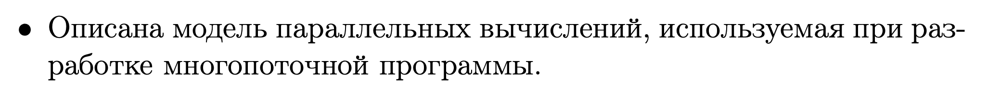
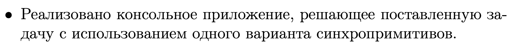
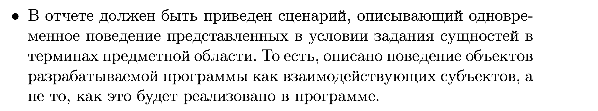
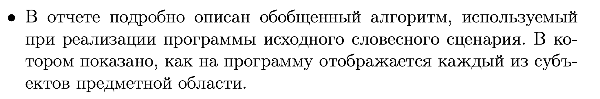
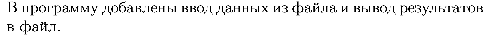
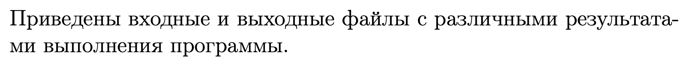
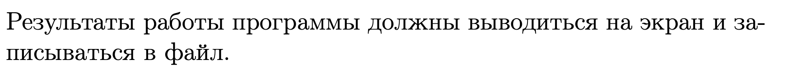
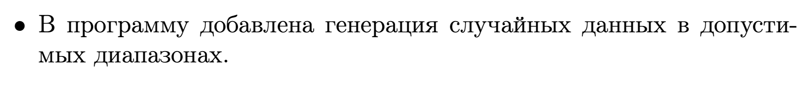

# ASM_HW4

БПИ 219 Талалаев Геннадий Алексеевич

# Отчёт 4 балла:
### 1

### 2

> Клиенты и серверы – еще один способ взаимодействия неравноправных потоков. Клиентский поток (Buyer) запрашивает сервер и ждет ответа. Серверный поток (Seller) ожидает запроса от клиента, затем действует в соответствии с поступившим запросом. 
> Каждый Buyer заполняют одну из трёх ячеек по конкретному индексу, если она пуста, и ждёт ответа от сервера (пока продавец обслуживает покупателя). Завершается, если план был выполнен. 
> Три Seller'а, каждый следит за своей одной ячейкой (ждёт запроса/сигнала), затем принимают полученного Buyer'а, обрабатывает его и помещает опять пустое значение, ожидая следующего запроса. Завершается, если кончились Buyer'ы, а так работает по принципу: "Солнце встало, нeгpы пашут, солнце село, нeгpы пляшут".

### 3

> 1. Потоков продавцов (Seller'ов) всегда три по условию
> 2. Количество потоков покупателей (Buyer'ов) задаваемое вручную значение
> 3. Количество дел в плане каждого покупателя задаваемое или случайное значение. Чем больше номеров отделов в плане, тем больше очередей и "конфликтов" между покупателями, то есть дольше работает программа, пока все не будут обслужены.
> 4. Если покупатели встали в очерь к одному продовцу одновременно, то порядок их обслуживания решается рыцарским поединком... Шутка! Просто какой-то поток случайно победит.

### 4

> Реализовано, лежит в файле main.cpp

### 5

> Реализован

### 6

> Отчет добавлен

---- 
 

# Отчёт 5 баллов:

### 1

> Коментарии добавлены

### 2

> 1. Магазин открывается - день начинается
> 2. Три продавца-потока открывают кассы в своих отделах и ждут пока все покупатели не закончатся, обрабатывая подходящих к ним клиентов
> 3. Приходит n покупателей-потоков со своими планами (к открытию магазина)
> 4. Покупатели, смотря на свои планы, по очереди проходят к нужным отделам, вставая в очередь только к нужному продавцу, не мешая другим очередям.
> 5. Будучи принятыми продавцом, который закончил работу с предыдущим клиентов, не дают подойти другим покупателям к этой же кассе.
> 6. Как только последний пункт из плана покупателя вычеркнут - он покидает магазин.
> 7. Как только все покупатели покинули магазин - продавцы перестают работать и тоже уходят.
> 8. Магазин закрыт - день закончен

Продавцы работают отдельно и никак не мешают друг-другу (вообще не пересекаются)
Покупатели занимают очередь к конкретному продавцу и принимаются по готовности

---- 
 

# Отчет 6 баллов:

### 1

>1. Запуск main
>2. Создание 3-х потоков продавцов и на каждого по mutex
>2.1. 3 Потока работают параллельно пока существует хотя бы 1 поток покупателя и ждут, когда значение покупателя станет значимым/ Если потоки закончатся -> 4
>2.2. Поток ожидает, когда к нему придет значение, через while
>2.3. Поток обрабатывает значение покупателя, и к i-ому элементу массива = nullptr - дальше возвращается в 2.2
>3.Создание n потоков покупателей
>3.1 N потоков работает параллельно
>3.2 Пока Виег имеет в плане номер отдела (его quee не пуста)
>3.2.1 lock mutex _[i]: проходит или ждёт (очередь к і-ому продавцу).
>3.2.2 і-ым значением массива ставит вместо nullptr себя.
>3.2.3 Пока продавец не поставит опять nullptr, покупатель ждёт.
>3.2.4 unlock mutex і - пускает следующего клиента
>3.2.5 Если план закончился - завершает поток -> 3.4
>3.3 Покупатель і-ый заменил і-ый nullptr на себя тем самым "отпустил" из while i-oro покупателя - дальше переходи в 2.3
>3.4 План закончился происходил Join потоков покупателей
>4 Join потоков продавцов
>5 Завершение программы

### 2

> Реализован
### 3

> Отчет сформирован

# Отчет на 7 баллов:
### 1

> Добавлен
### 2

> Приведены
### 3

> Выводится на экран и записывается в файл
### 4

> Расширен
### 5

> Отражены

# Отчет на 8 баллов:
### 1

> Добавлена
### 2

> Приведены
### 3

> Расширен
### 4

> Отражены

